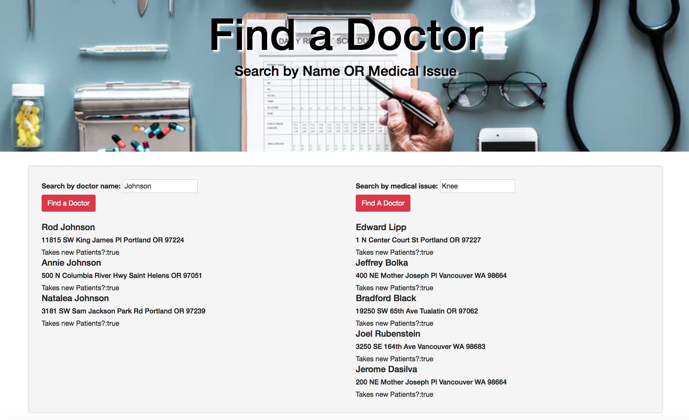

# BetterDoctor API

#### _Kaila Goff_

#### _An application where users can input their symptoms and location and have relevant doctors in the area listed. 3-23-18_

<kbd></kbd>

### Specifications

1. A user should be able to enter a medical issue to receive a list of doctors in the Portland area that fit the search query.

2. A user should be able to to enter a name to receive a list of doctors in the Portland area that fit the search query.

3. If the query response includes any doctors, the following information should be included about each doctor: first name, last name, address, phone number, website and whether or not the doctor is accepting new patients (the API provides this data).

4. If the API call results in an error (any message not a 200 OK), the application should return a notification that states what the error is.

5. If the query response doesn't include any doctors (for instance, if no doctors meet the search criteria), the application should return a notification that states that no doctors meet the criteria. (This is not an error so it should be handled separately from any errors.)

## Setup/Installation Requirements

   * Clone the project to your local machine from `[GitHub](http://github.com)`

   * Move into the project directory with `$cd doctor_api`

   * Create a file in the terminal with `$ touch .env`

   * Add `exports.apiKey = [your_api_key_here];` into .env

   * Install npm dependencies with `$npm install`

   * Build, start, and open the project with `$npm start`

## Known Bugs

  * _No known bugs at this time._

## Support and Contact Details

  _To suggest changes, contact me through GitHub._

## Technologies Used

    * HTML
    * JavaScript
    * jQuery
    * Bootstrap

## Dev environment built with

   * Npm
   * Webpack
   * Jasmine
   * Karma
   * Babel
   * BetterDoctor API

### License

MIT License

Copyright (c) 2018 **Kaila Goff**
